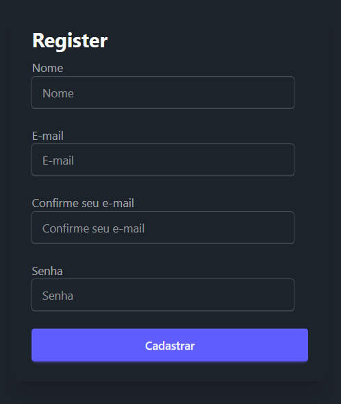
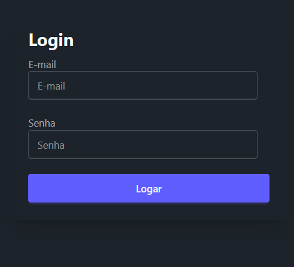
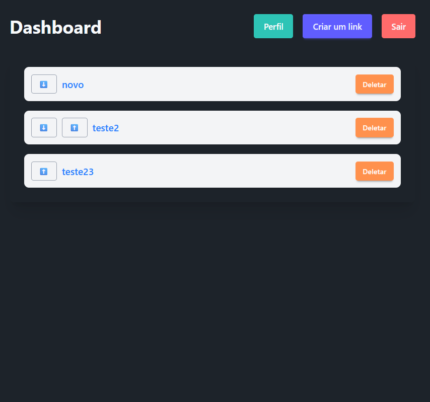
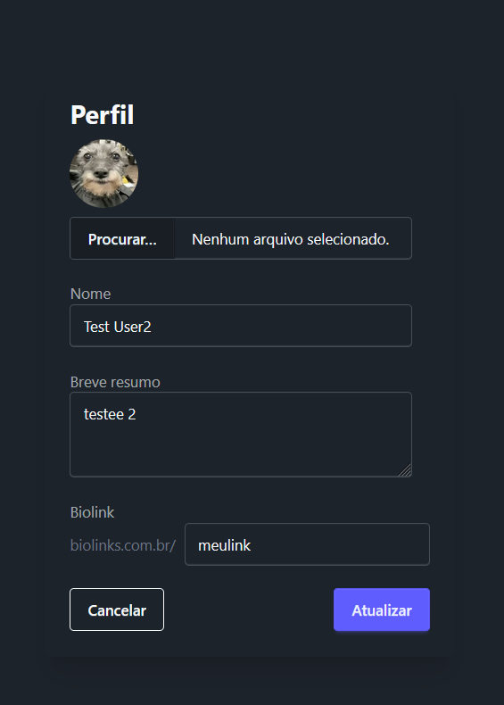
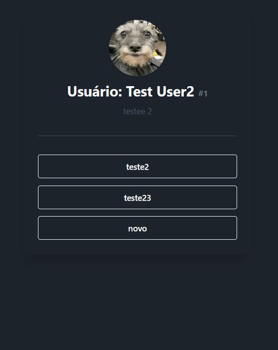
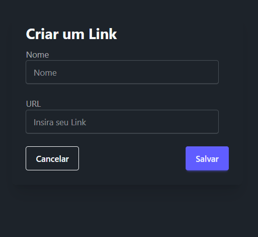

# Biolinks

Este projeto foi desenvolvido com base no curso de Laravel da Rocketseat. O **Biolinks** é uma aplicação CRUD que permite aos usuários registrar e gerenciar links de acesso, similar ao Linktree.

## Funcionalidades

- **Cadastro e gerenciamento de links**: Os usuários podem adicionar, editar e excluir links de acesso.
- **Ordenação de links**: É possível organizar os links na ordem desejada.
- **Geração de URL pública**: Cada usuário pode gerar uma URL pública que exibe um resumo do seu perfil e seus links.

## Tecnologias Utilizadas

- [Laravel](https://laravel.com/) - Framework PHP para desenvolvimento web.
- [MySQL](https://www.mysql.com/) - Banco de dados relacional.
- [daisyUI](https://daisyui.com/) - Biblioteca de componentes UI para Tailwind CSS.

## Preview do Projeto

- Registro:

- Login:

- Dashboard:

- Perfil:

- URL Pública:

- Criar Link:

---
Desenvolvido durante o curso de Laravel da Rocketseat.